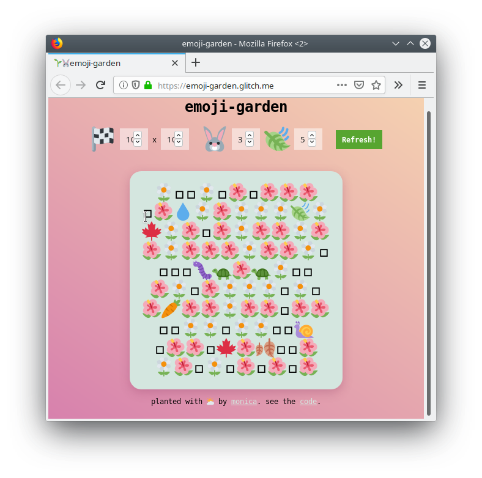

# meetup-game-emoji-garden
A game for meetups to involve people, this would have many people selecting at least one emoji, that they can then place into the garden.

# Components

# 1. garden-server-display forked from:
## 🌱🐰 [emoji-garden](https://emoji-garden.glitch.me/) by [Monica Dinculescu](https://twitter.com/notwaldorf)

Generates a random emoji garden. Built with [tracery.js](https://github.com/galaxykate/tracery).

# 2. garden-client-web-app
The user-side client that allows people to pick and place thier emoji

# 3. garden-server-backend
This will be the firebase project that co-ordinates between a large number of clients as they simultaneously pick a location on the garden for their emoji.
